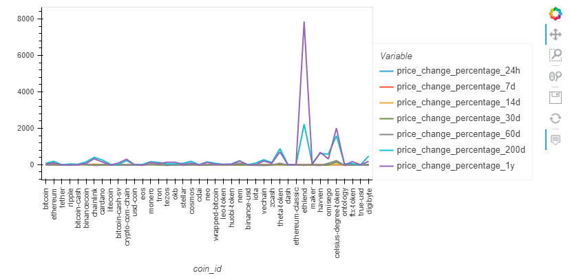
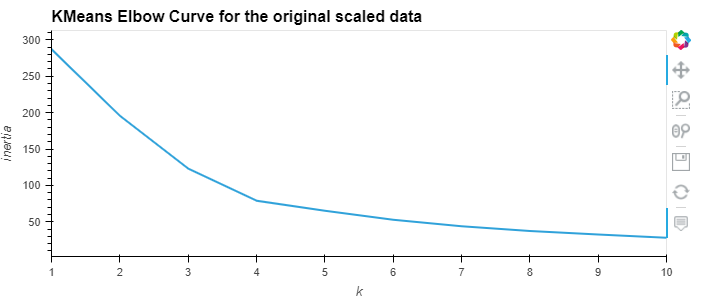
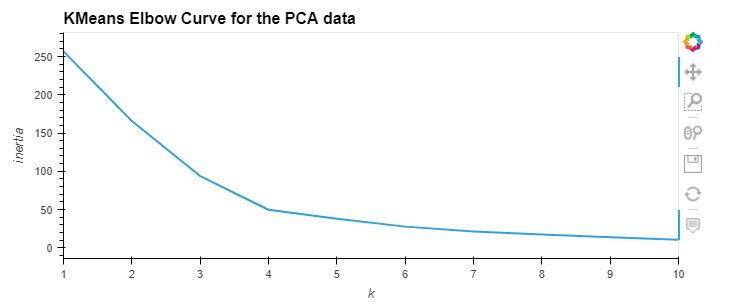
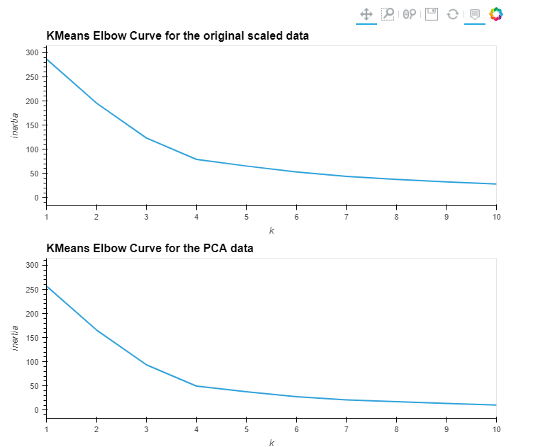
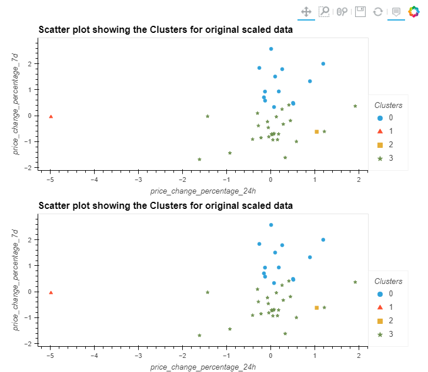

# Crypto_Investments

This script can be used to cluster cryptocurrencies by their performance in different time periods.

# Analysis

## Visualizing the data provided



<br>

This visualization make Ethlend and Celsius-degree token stand out as they have the highest and the second highest percentage change in the one year and 200 day time frame.

---

## KMeans clustering on Original Scaled Data

### Elbow Analysis to determine the optimal number of clusters


#### **Question:** What is the best value for `k`?
#### **Answer:** From the Elbow curve, it seems the best value for k is 4.
---
### Cluster Cryptocurrencies with K-means Using the Original Data


The 4 clusters do not make sense in this scatter plot, but we can see like we had seen in the earlier section, Ethlend and Celsius-degree token are placed in their own different clusters. A better visualisation of the clusters can be seen in the following visualization:


Cluster 0 in blue, shows cryptocurrencies with higher 7d percentage change, but a low 1 year change.<br>
Cluster 1 in red, shows Ethlend, which has a negative 7 day percentage change, but ther highest 1 year change <br>
Cluster 2 in yellow, shows Celsius-degree token, which also has a negative 7 day percentage change, but a significantly higher 1 year change, though this change is significantly less than Ethlend, hence the different cluster <br>
Cluster 3 in green, shows the cryptocurrencies with lower 7d percentage change, and a low 1 year change. <br>

---
## Optimize Clusters with Principal Component Analysis

**Question:** What is the total explained variance of the three principal components?

**Answer:** The total explained variance of the three principal components is about 89.5%

### Elbow Analysis to determine the optimal number of clusters for PCA data



* **Question:** What is the best value for `k` when using the PCA data?

  * **Answer:** The best value for k using the PCA data is 4


* **Question:** Does it differ from the best k value found using the original data?

  * **Answer:** No. it does not differ from the k value found using the original data. This makes sense as the 3 PCA components store about 89.5% of the information from the original data
---
### Cluster Cryptocurrencies with K-means Using the PCA Data


---
### Visualize and Compare the Results

#### Composite plot to contrast the Elbow curves



The elbow curves in both the cases have a similar curve, the only difference being the value of inertia. This can be explained by the loss of about 10% information during PCA.

#### Compoosite plot to contrast the clusters


The clusters are again distributed similarly in both the cases. As the 3 components of PCA decomposition are preserving almost 89.5% of the information from the original data, this is an expected result. 

  * **Question:** After visually analyzing the cluster analysis results, what is the impact of using fewer features to cluster the data using K-Means?

  * **Answer:**  After visually analyzing the cluster analysis results, using fewer features does not have a significant effect onthe clustering algorithm. The clusters are exactly same in both the cases. The only difference is in the value of inertia, which seems to have dropped a little when analysis is done using PCA. Both these trends can be explained by the fact that explained variance ratio of the first three components is about 89.5%, thus preserving most of the information of the original dataset. 

  ---
  ## Technologies

This project uses python 3.7 along with the following packages:

* [JupyterLab](https://jupyterlab.readthedocs.io/en/stable/) - Web based user interface for data analysis.

* [pandas](https://github.com/pandas-dev/pandas) - Data analysis and manipulation library.

* [hvplot](https://pyviz-dev.github.io/hvplot/) - A high-level plotting API for the PyData ecosystem built on HoloViews.

* [sklearn](https://github.com/scikit-learn/scikit-learn) - A Python module for machine learning built on top of SciPy
---

## Installation Guide

Please install the following before starting the application

```python
  pip install jupyterlab
  pip install pandas
  pip install hvplot 
  pip install scikit-learn
```
---

## Usage

To use the Crypto investment tools, please download and open the **crypto_investments.ipynb** in jupyter lab after executing
the following on the command line:

```python
jupyter lab
```
Jupytper Lab should open automatically in a browser. 
If it does not, please follow the instructions on the command line.

---

## Contributors

Abhishika Fatehpuria (abhishika@gmail.com)

---

## License

MIT